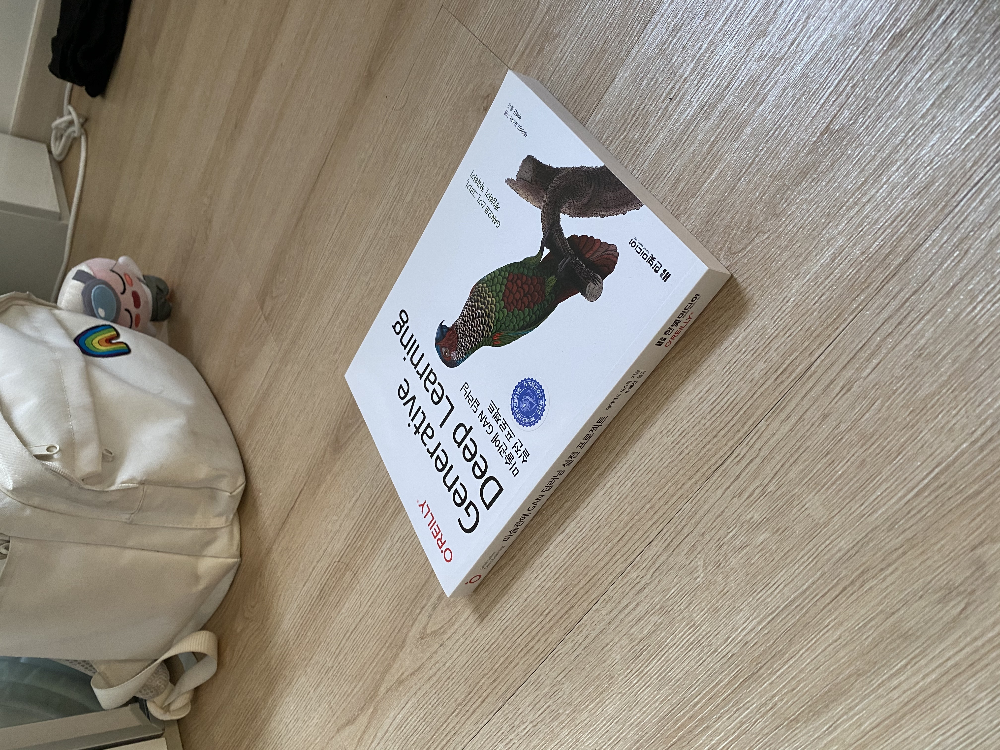
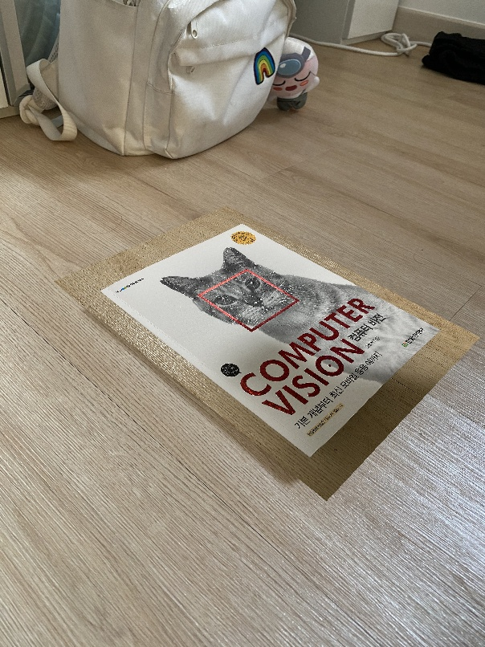

# **영상 Homography 계산 및 와핑 영상 합성 실습**
6주차 Assignment에 대한 Code 제출물과 간략한 Review를 포함하고 있습니다.  
자세한 서술과 결과 정리는 Report에 포함되어 있습니다.


## Environment
각 팀원의 개발 및 테스트 환경은 아래와 같습니다.
| **Name** | **OS** | **OpenCV Library** | **Language** | **IDE** | 
|:--------:|:--------:|:--------:|:--------:|:--------:|
| 유승욱 | Windows 10 | OpenCV 4.5.1 | C++ | Visual Studio 2019  |
| 이나혁 | Windows 10 | OpenCV 4.5.2 | C++ | Visual Studio 2019 |
| 이하윤 | Mac OS 11 Big Sur | OpenCV 4.5.1 | C++ | Xcode 12.4 |

## Run
Code는 OpenCV 4.5.2버전을 통해 개발 및 테스트 되었으며, 원활한 동작을 위해 동일한 버전의 OpenCV를 사용하는 것을 추천드립니다.

```
$ g++ main.cpp -o app `pkg-config --cflags --libs opencv`
```

## Sample Result
샘플 결과는 아래와 같습니다. 세부 결과는 Report에서 확인할 수 있습니다.
  

## Code Review

### Header
OpenCV 함수 이용을 위한 core, highgui, imgproc 헤더 선언
```cpp
#include <iostream>
#include <opencv2/core.hpp>
#include <opencv2/highgui.hpp>
#include <opencv2/imgproc.hpp>
```

### Calculate Homography
행렬 A 정의
```cpp
    /** 호모그래피 계산 **/
    int x1 = get<0>(location01[0]);
    int y1 = get<1>(location01[0]);
    // ... 생략 (전체 코드 github에 업로드)
    
    // 행렬 A 정의
    Mat A = Mat::zeros(8, 9, CV_32F);
    A.at<float>(0, 0) = -x1;
    A.at<float>(0, 1) = -y1;
    A.at<float>(0, 2) = -1;
    A.at<float>(0, 6) = x1 * x1_p;
    A.at<float>(0, 7) = y1 * x1_p;
    A.at<float>(0, 8) = x1_p;
    // ... 생략 (전체 코드 github에 업로드)
    
}
```
DLT 이용해 Ah = 0 풂
```cpp
    Mat U, D, VT, V;
```
h 구하기 위해 행렬 A에 대한 SVD를 구함
```cpp
    SVDecomp(A, U, D, VT, SVD::FULL_UV);
```
행렬 VT를 전치해 V 획득
```cpp
    transpose(VT, V);
```
h(9X1)는 행렬 V의 오른쪽 끝 Row 벡터
```cpp
    Mat H_row = V.col(8);
```
열 벡터 형태의 h를 3X3 사이즈의 H 행렬로 전환
```cpp
    Mat H = Mat::ones(3, 3, CV_32F);
    H.at<float>(0, 0) = H_row.at<float>(0, 0);
    H.at<float>(0, 1) = H_row.at<float>(1, 0);
    H.at<float>(0, 2) = H_row.at<float>(2, 0);
    H.at<float>(1, 0) = H_row.at<float>(3, 0);
    H.at<float>(1, 1) = H_row.at<float>(4, 0);
    H.at<float>(1, 2) = H_row.at<float>(5, 0);
    H.at<float>(2, 0) = H_row.at<float>(6, 0);
    H.at<float>(2, 1) = H_row.at<float>(7, 0);
    H.at<float>(2, 2) = H_row.at<float>(8, 0);

    H = H / H.at<float>(2, 2);
```

### 후방기하변환
Target 이미지의 pixel이 Source 이미지에 어느 위치에 존재하는지 계산
```cpp
    for (int y = 0; y < img2.rows; y++) {
        for (int x = 0; x < img2.cols; x++) {

            // Homogeneous Coordinate 이용
            Mat pixel_p = Mat::ones(3, 1, CV_32F);
            pixel_p.at<float>(0, 0) = x;
            pixel_p.at<float>(1, 0) = y;
            
            // H의 역행렬을 통해 X' -> X 변환
            Mat pixel = Mat::ones(3, 3, CV_32F);
            pixel = H.inv() * pixel_p;
            pixel = pixel / pixel.at<float>(2, 0);
            // ... 생략 (전체코드 github에 업로드)

```

후방 변환만 수행
```cpp
                dst2.at<Vec3b>(y, x)[0] = src.at<Vec3b>(pixel_y, pixel_x)[0]; // 3채널의 B, G, R pixel 값을 각각 수정
                dst2.at<Vec3b>(y, x)[1] = src.at<Vec3b>(pixel_y, pixel_x)[1];
                dst2.at<Vec3b>(y, x)[2] = src.at<Vec3b>(pixel_y, pixel_x)[2];
```
후방 변환 + 양선형 보간 수행
```cpp
                if (pixel_y < img2.rows - 1 && pixel_x < img2.cols - 1) {
                    // 인접한 두 픽셀과의 거리 계산
                    float a = pixel.at<float>(0, 0) - pixel_x;
                    float b = pixel.at<float>(1, 0) - pixel_y;
                    
                    // 2차원 보간식 유도
                    // f(y, x)
                    float f_yx_B = src.at<Vec3b>(pixel_y, pixel_x)[0];
                    float f_yx_G = src.at<Vec3b>(pixel_y, pixel_x)[1];
                    float f_yx_R = src.at<Vec3b>(pixel_y, pixel_x)[2];

                    // f(y,x') = (1-a) f(y,x) + a f(y,x+1)
                    float f_yx_p_B = ((1 - a) * f_yx_B) + (a * src.at<Vec3b>(pixel_y, pixel_x + 1)[0]);
                    float f_yx_p_G = ((1 - a) * f_yx_G) + (a * src.at<Vec3b>(pixel_y, pixel_x + 1)[1]);
                    float f_yx_p_R = ((1 - a) * f_yx_R) + (a * src.at<Vec3b>(pixel_y, pixel_x + 1)[2]);

                    // f(y+1,x') = (1-a) f(y+1, x) + a f(y+1, x+1)
                    float f_ya_x_p_B = ((1 - a) * src.at<Vec3b>(pixel_y + 1, pixel_x)[0]) + (a * (src.at<Vec3b>(pixel_y + 1, pixel_x + 1)[0]));
                    float f_ya_x_p_G = ((1 - a) * src.at<Vec3b>(pixel_y + 1, pixel_x)[1]) + (a * (src.at<Vec3b>(pixel_y + 1, pixel_x + 1)[1]));
                    float f_ya_x_p_R = ((1 - a) * src.at<Vec3b>(pixel_y + 1, pixel_x)[2]) + (a * (src.at<Vec3b>(pixel_y + 1, pixel_x + 1)[2]));

                    // f(y', x') = (1-b) f(y, x') + b f(y+1, x')
                    float f_y_p_x_p_B = ((1 - b) * f_yx_p_B) + (b * f_ya_x_p_B);
                    float f_y_p_x_p_G = ((1 - b) * f_yx_p_G) + (b * f_ya_x_p_G);
                    float f_y_p_x_p_R = ((1 - b) * f_yx_p_R) + (b * f_ya_x_p_R);
                    // ... 중략 (전체 코드 github에 업로드)
                    
                // 오른쪽, 아래 모서리의 경우 보간 이용하지 않고 기존 Source 이미지의 픽셀 그대로 이용
                else {
                    dst.at<Vec3b>(y, x)[0] = src.at<Vec3b>(pixel_y, pixel_x)[0]; // 3채널의 B, G, R pixel 값을 각각 수정
                    dst.at<Vec3b>(y, x)[1] = src.at<Vec3b>(pixel_y, pixel_x)[1];
                    dst.at<Vec3b>(y, x)[2] = src.at<Vec3b>(pixel_y, pixel_x)[2];
                }
```
