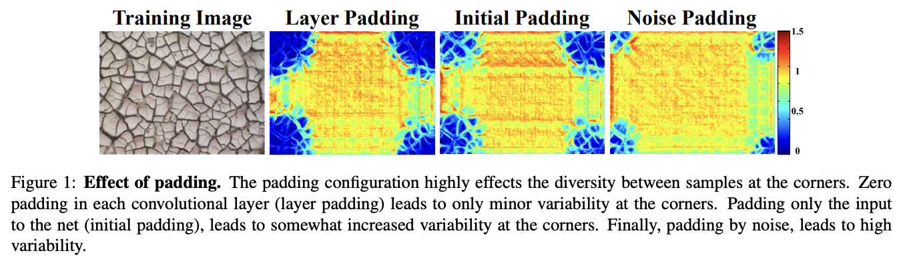

# **SinGAN : Learning a Generative Model from a Single Natural Image**
[Project](https://tamarott.github.io/SinGAN.htm) | [Arxiv](https://arxiv.org/pdf/1905.01164.pdf) | [CVF](http://openaccess.thecvf.com/content_ICCV_2019/papers/Shaham_SinGAN_Learning_a_Generative_Model_From_a_Single_Natural_Image_ICCV_2019_paper.pdf) | [Supplementary materials](https://openaccess.thecvf.com/content_ICCV_2019/supplemental/Shaham_SinGAN_Learning_a_ICCV_2019_supplemental.pdf) | [Talk (ICCV`19)](https://youtu.be/mdAcPe74tZI?t=3191) 

## Introduction  

 

* Contribution  
  * **한 장의 이미지**로부터 새로운 이미지를 생성하는 방법 제시
  * Fully convolutional network로 구성하여 **이미지 사이즈에대한 제약 X**
  * 학습된 모델을 super-resolution, paint-to-image, harmonization, editing, single image animation task에 응용 가능

* Limitation
  * 학습 시간 오래 걸림, 이미지에 대한 일반성 없음
  * 이미지 내부의 통계적 특성을 사용하므로 의미적인 다양성을 학습하기에 어려움
    * 예를들어 한 마리의 강아지만 등장하는 이미지를 통해서는 여러 종의 강아지를 생성할 수 없음

## Method  
### 1. Multi-Scale architecture
핵심 아이디어!  

<image src = "./src/multi_scale_pipeline.png">

* Scale factor
  * 단계별로 3/4 정도의 차이
  * 8단계
  * 가장 작은 단계에서 짧은 축이 25px이 되도록 설정. 따라서 가장 큰 단계에서 짧은 축을 250px로 resize

* Receptive field
  * 3*3 size로 5번 convolution => 유효 receptive field 사이즈 11
  * 가장 작은 단계 (N=8)에서는 전체 이미지의 절반에 해당하는 영역을 커버
    * Global structure 추출
  * 가장 큰 단계 (N=0)에서는 이미지의 일부 영역만을 커버
    * Fine detail 추출

* N 단계의 generator에는 그 전 단계의 모든 generator가 사용됨
  * N+1 단계의 generator에서 얻어진 output을 scale factor만큼 upscale하여 입력으로 사용
  * N 단계의 generator를 학습시킨 후 고정시키고 N-1 단계의 generator를 학습시키는 방식
  * 모든 generator 및 모든 discriminator들은 같은 구조를 가지며 따로 학습됨
  * N 단계의 generator는 N+1 단계의 파라미터로 초기화

#### **요약**
* 모델은 ${G_{0},...,G_{N}}$ 의 생성자의 피라미드 구조로 구성, 이미지 또한 ${x_{0},...,x_{N}}$ 의 버전으로 되어 있음  
* $x_{n}$은 이미지 $x$의 다운샘플된 버전으로 downsample factor에 의해 다운샘플 됨  
* 각 생성자 $G_{n}$은 이에 상응하는 $x_{n}$에 대한 이미지를 학습하고, 판별자 $D_{n}$은 생성된 이미지의 패치와 $x_{n}$ 이미지로부터의 패치를 구분하도록 시도
* **coarse-to-fine**하게 학습
  * 이미지의 전반적인 구조를 먼저 학습하고 점점 세밀한 구조를 학습
  * 가장 처음은 전체적인 구조(coarsest scale)에서 시작
  * coarsest scale에서는 $G_{N}$이 $z_{N}$가 Gaussian Noise를 이미지 샘플 $\tilde{x}_{N}$으로 맵핑
  * 더 세밀한 스케일의 생성자 $G_{N} (n < N)$은 이전의 스케일에서 생성되지 않은 디테일이 들어감
  * 각 생성자 $G_{N}$은 이전의 더 거친 스케일의 이미지 비전을 업스케일 하려고 시도

### 2. Network architecture (Generator)  

<image src = "./src/single_scale_generation.png">

Generator의 Operation :  
 
<image src = "./src/operation.png" width=47%>

* Convolution Layer 5번 반복
  * 각 layer는 Conv(3 x 3) - BatchNorm - LeakyReLU 구조를 따름
  * 단일 배치로 학습하는데 BatchNorm을 사용하는 것이 이상해 구현 시에는 InstanceNorm 사용
  * filter size는 32로 시작해 4단계마다 두 배씩 늘림

* 입력에는 N+1 단계에서 생성된 이미지와 동일한 사이즈의 노이즈를 더하여 입력
* 출력과 N+1 단계에서 생성된 이미지를 더함
* Discriminator는 같은 구조의 Convolution layer들만 사용
  * Noise, skip connection 사용 안함
  * PatchGAN 처럼 결과를 평균내어 사용
* 첫 단계 (N=8)에서는 노이즈만 사용. 입력 이미지를 0으로 만들어 사용하는 것으로 생각할 수 있음

#### **요약**  
Generator는 동시에 1. 업스케일하면서 2. 생성한다.

### 3. Training  

<image src = "./src/loss1.png">

<image src = "./src/loss2.png">

* Loss Function
  * adversarial loss와 reconstruction loss 사용
    * reconstruction loss는 생성한 이미지와 원래의 이미지 간의 차이를 줄이는 방향으로 학습하기 위함
  * 계수는 10~100
  * reconstruction loss 구할 때는 random noise 대신에 처음 (N=8)에는 고정된 noise x_fixed를, 이후에는 0 사용
  * input noise를 reconstruction loss에 비례하게끔 설정

* Optimization
  * WGAN-gp 사용, gp계수 0.1 사용
  * scale당 2000 iteration, iteration 당 Descriminator 3번, Generator 3번씩 학습
  * learning rate 0.0005, 1600번째 iteration 때 0.1배

* Boundary conditions and the effect of padding  

  * 처음에 (receptive seze / 2)만큼 padding을 주고 Conv layer에서는 padding 사용하지 않음
  * Random patch로 쪼개지 않고 단일 배치고 이미지 전체에 대하여 계산 후 평균을 내 학습

## **Result**

